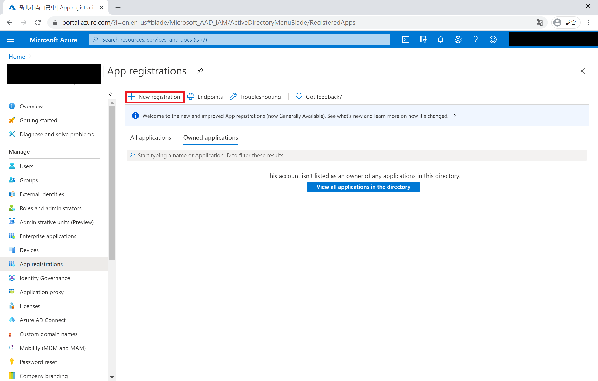
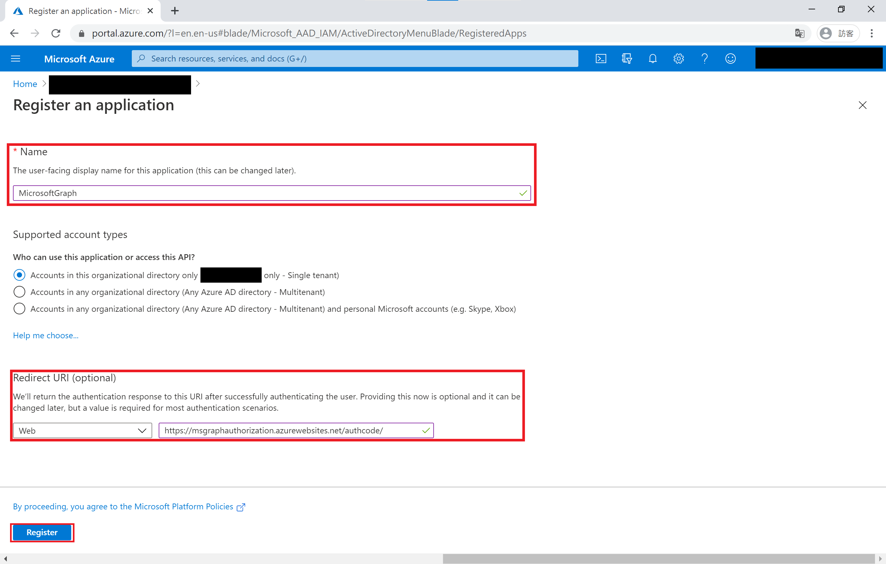
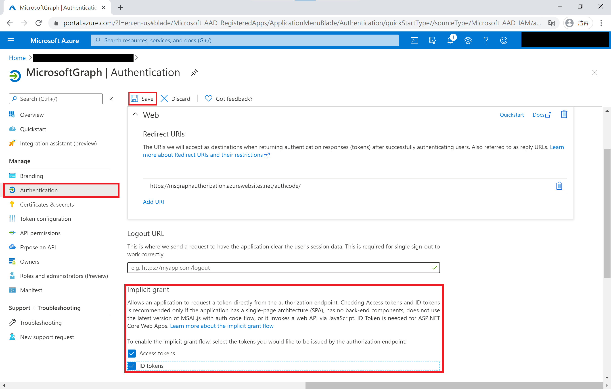
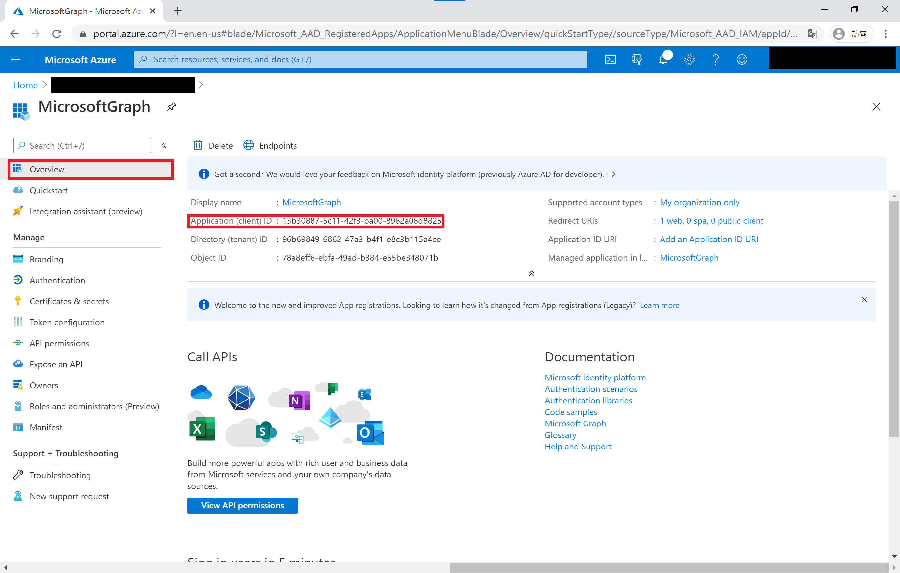
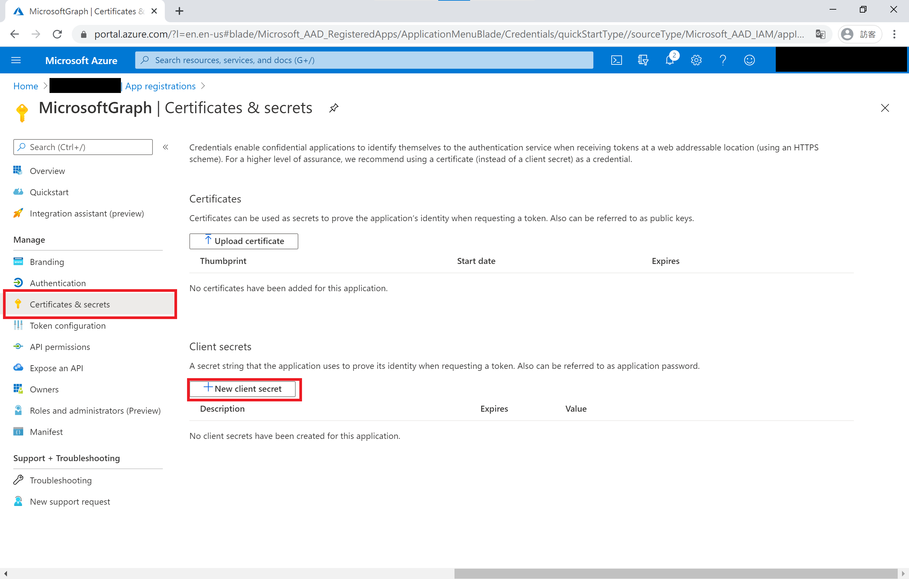
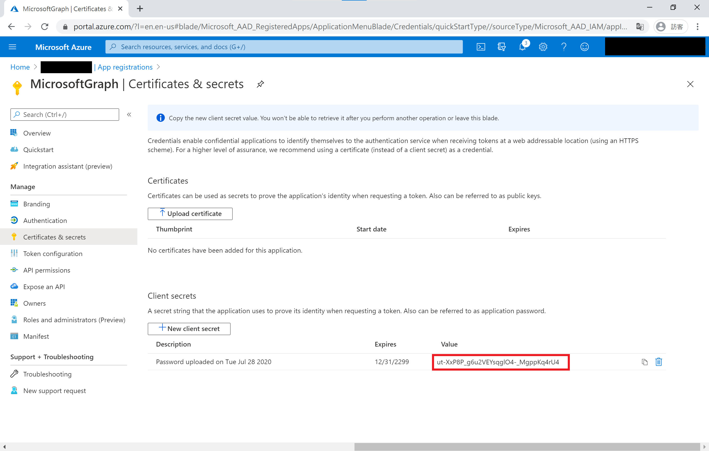

# Azure 應用程式註冊教學
[Microsoft Graph API](https://developer.microsoft.com/en-us/graph) 是一個 RESTful 的 Web API，可讓您存取 Microsoft Cloud 服務資源。 對 Microsoft Graph API 提出請求前，必須**註冊 Azure 應用程式**並取得使用者或服務的驗證權杖，才能使用 Microsoft Graph API 相關服務。

## 開始註冊應用程式

1. 開啟 [Azure 應用程式註冊](https://portal.azure.com/#blade/Microsoft_AAD_IAM/ActiveDirectoryMenuBlade/RegisteredApps) 網頁，點擊 **新增註冊 [New registration]**。

    

1. 請在上方 **名稱 [Name]** 欄位為應用程式取一個名稱。下方 **重新導向 URI [Redirect URI]** 選擇Web，並且填入 [https://msgraphauthorization.azurewebsites.net/authcode/](https://msgraphauthorization.azurewebsites.net/authcode/)

    

1. 切換至 **驗證 [Authentication]** 頁面，將網頁中間 **隱含授與 [Implicit grant]** 內的兩個選項打勾，然後點擊上方的 **儲存 [Save]**。
    - 存取權杖[Access tokens]
    - 識別碼權杖[ID tokens]

    

1. 回到 **概觀 [Overview]** 頁面，將 **應用程式 (用戶端) 識別碼 [Application (client) ID]** 記錄下來，Bot 建立 Azure 應用程式需要這個值。

    

1. 切換至 **憑證及祕密 [Certificates & secrets]** 頁面，點擊下方 **新增用戶端密碼 [New client secret]** 按鈕。

    

1. 在 **到期 [Expires]** 選項選擇 **永不 [Never]**

    

1. 將 Azure 產生 **用戶端密碼 [Client secrets]**  的值記錄下來，Bot 建立 Azure 應用程式需要這個值。

    

1. 最後將剛剛紀錄 **應用程式 (用戶端) 識別碼 [Application (client) ID]** 及 **用戶端密碼 [Client secrets]** 回覆給Bot。
