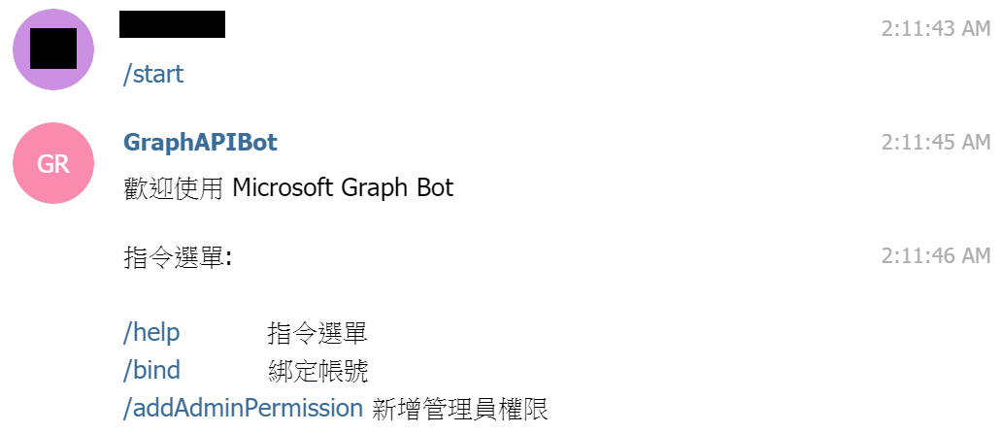
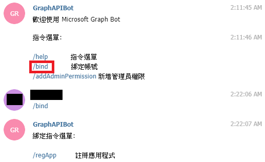
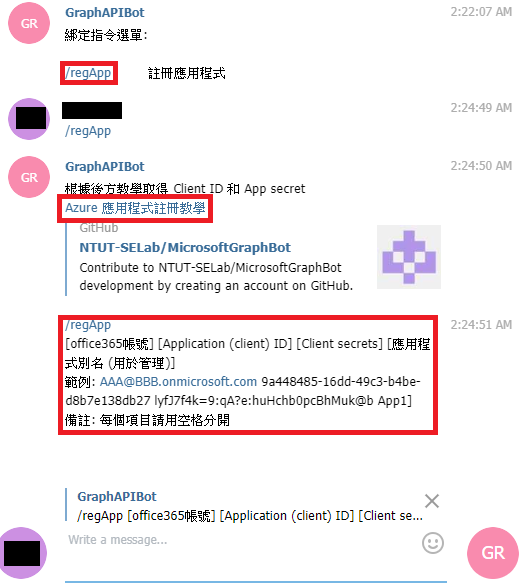
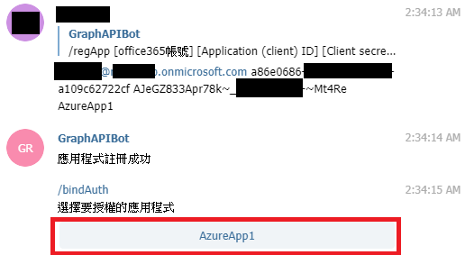
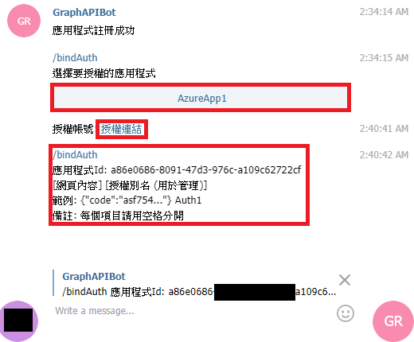
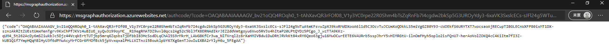
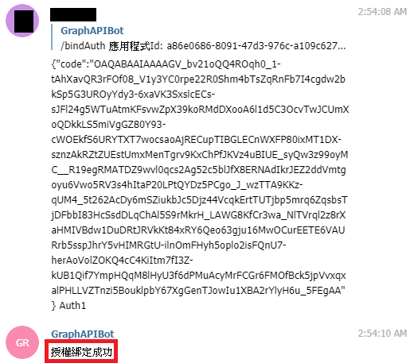

# 綁定 **Office 365** 授權教學
Bot 需要取得你的 **Office 365 Token** 才能為你服務，要取得你的 **Token** 必須經過你的授權，本教學將一步步帶領你授權 **Bot** 取得你的**Token**。

1. 與你的 Bot 開始聊天

    

1. 點擊 **/bind** 指令

    

1. 點擊 **/regApp** 指令，Bot輔助你如何註冊 Azure 應用程式。首先點擊如下圖第二個紅框的 [Azure 應用程式註冊教學](./AppRegistrations.md)，按照教學手動建立 Azure 應用程式，接下來將教學要求紀錄的訊息依照第三個紅框的格式回覆給 **Bot**。

    

1. 回覆後，**Bot** 會去驗證你剛註冊的應用程式是否成功，成功的話 **Bot** 會回覆 **應用程式註冊成功** 的訊息，接下來提示你選擇一個應用程式用來授權。

    

1. 點擊要授權的應用程式後，**Bot** 會產生 **授權連結** 如下圖的第二個紅框，點擊連結後會開啟微軟的網頁，請登入你的 **Office 365** 帳號，並且同意授權，之後網頁會導向到下面第二張圖的網站，將內容複製並按照第一張圖的第三個紅框要求，按照指定格式將內容回覆給 **Bot**。

    
    

1. 回覆後，**Bot** 會去驗證你剛剛的授權是否成功，並取得 **Token**。成功的話 **Bot** 會回覆 **授權綁定成功** 的訊息
    

1. 恭喜綁定成功
