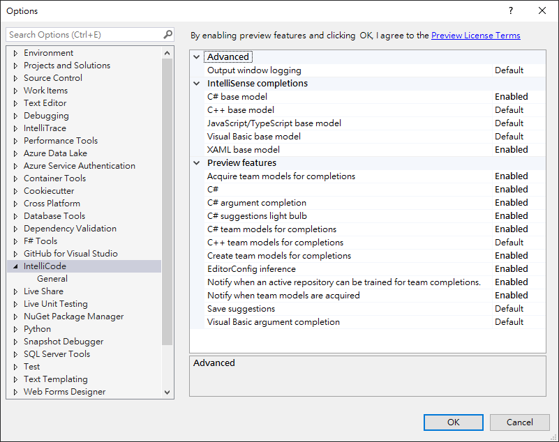

## 為 **MicrosoftGraphBot** 做出貢獻
如果您有興趣為穩定基準做出貢獻，您的貢獻將分為兩類：

1. 您想提出一個新功能並實施它
    - 創建有關您的預期功能的問題，我們將討論設計和實現。一旦我們同意該計劃看起來不錯，請繼續執行它。

1. 您想為未解決的問題實施功能或錯誤修復
    - 在這裡查看未解決的問題：https://github.com/NTUT-SELab/MicrosoftGraphBot/issues
    - 在這裡查看路線圖：https://github.com/NTUT-SELab/MicrosoftGraphBot/projects/2
    - 選擇一個問題或功能，並對此問題或功能發表評論。
    - 如果您需要有關特定問題的更多背景信息，請提出需求，我們將提供更多背景信息。

完成功能或錯誤修復後，請向 https://github.com/NTUT-SELab/MicrosoftGraphBot 開啟 **pull request**，針對不同情境 **pull request** 指向的目標 branch 也不同。(備註: 禁止對 master 及 release 分支開啟 **pull request**)
- 增加功能: 請將目標指向 develop 分支
- 解決Bug: 請將目標指向 hotfix 分支
- 編輯文檔: 請將目標指向 document 分支

如果您不熟悉創建請求請求，請參考以下指南：
- http://stackoverflow.com/questions/14680711/how-to-do-a-github-pull-request
- https://help.github.com/articles/creating-a-pull-request/

## Pull Request (PR)
在提出PR之前，請先提出一個問題，然後對該功能進行討論。這樣可以避免提出重複的PR，也可以簡化代碼審查過程。

## 開發 **MicrosoftGraphBot**

1. 安裝 [Dotnet core 3.1 SDK](https://dotnet.microsoft.com/download/dotnet-core/3.1)
    - 如果 電腦已經安裝 **Visual studio 2019** 或更新版本，並且安裝 **.NET Core 跨平台開發** 功能可略過該步驟。

1. 從 Github clone **MicrosoftGraphBot** 程式碼
    ```
    git clone https://github.com/NTUT-SELab/MicrosoftGraphBot/
    cd MicrosoftGraphBot
    ```

1. 還原相依性套件
    ```
    dotnet restore
    ```

1. 將 [appsettings.json.example](../appsettings.json.example) 複製到 **MicrosoftGraphAPIBot** 資料夾中，並將 **appsettings.json.example** 重新命名成 **appsettings.json**

1. 編輯 **appsettings.json** 內的 `Telegram:Token`，替換成自己 Bot 的 Token。

1. 如果使用 **Visual studio 2019** 或更新版本可以使用 [Visual Studio IntelliCode](https://visualstudio.microsoft.com/services/intellicode/) 提高開發效率。
    - 配置內容如下: 工具->選項-> **IntelliCode**
    

1. 執行程式需要依賴 Microsoft SQL server，這邊提供兩種方法
    - Docker(推薦):
        - Windows:
            1. 用**管理者權限**開啟 Powershell
            1. 執行 Scripts -> StartSqlServer -> StartSqlServer.ps1
                ```
                PS C:\MicrosoftGraphBot> .\Scripts\StartSqlServer\StartSqlServer.ps1
                ```

        - Linux & MacOS
            1. 執行 Scripts -> StartSqlServer -> StartSqlServer.sh
                ```
                root@docker_server:~/MicrosoftGraphBot$ sudo ./Scripts/StartSqlServer/StartSqlServer.sh
                ```

    - 自行安裝 [SQL server](https://www.microsoft.com/zh-tw/sql-server/sql-server-downloads)
        - 安裝 [SQL server](https://www.microsoft.com/zh-tw/sql-server/sql-server-downloads)
        - 編輯 **appsettings.json** 內 MSSQL 配置項的配置

## 測試
任何修改除了文檔都必須在 MicrosoftGraphBotTests 增加測試，以確保一切正常。

執行測試的方法有兩種:
1. Visual Studio 測試功能
    - 檢視 -> Test Explorer

1. 指令:
    ```
    dotnet test
    ```

## 變更日誌和文檔
請不要忘記更新變更日誌（ReleaseNote/Changelog.md）並根據需要添加文檔。

變更日誌內容範例:
```
- 支援 Outlook API [(#3)](https://github.com/NTUT-SELab/MicrosoftGraphBot/issues/3) [(pr0)](https://github.com/NTUT-SELab/MicrosoftGraphBot/pull/0)
```
